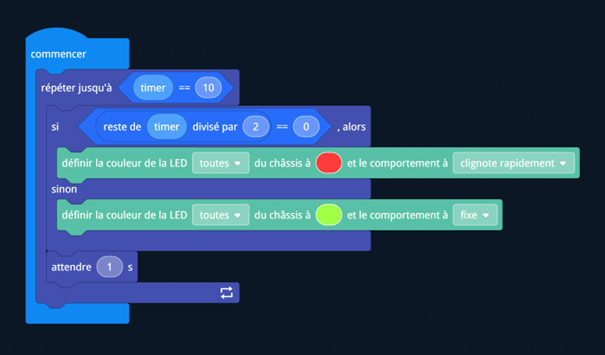

<style src="./style.css">
    * {
    text-align: justify;
}
ol {
    list-style-type: upper-roman;
}
ol ol {
    list-style-type: decimal;
}
ol ol ol {
    list-style-type: lower-alpha;
}
.center {
    text-align: center;
}
.caption {
    font-size: 11px;
    font-style: italic;
    margin: 0;
    padding: none;
}

</style>

<h1 class="center">CT.2410 – Robotique <br/> Rapport</h1>

Louis **DUBOIS**

# Table des Matières
1.   [Introduction](#introduction)
2.  [Etude préliminaire](#etude-préliminaire)
4.  [Mise en place de l'environnement de développement](#mise-en-place-de-lenvironnement-de-développement)
    1. [Configuration de Python](#configuration-de-python)
        1. [Installation de Python 3.8.9](#installation-de-python-389)
            - [Windows](#windows)
            - [Linux](#linux)
            - [MacOS](#macos)


# Introduction
Le principe de ce projet est de réaliser une API pour le robot en python. Notre but est donc de comprendre comment fonctionne l’API avec la programmation en block de type scratch pour pouvoir ensuite rajouter des fonctionnalités en python. Nous avons donc étudié la possibilité d’utiliser un autre éditeur Blockly que l’application du robot et nous sommes intéresser à la façon avec laquelle le robot avait la possibilité de communiquer entre lui et l’application. Une fois que cela a été compris nous avons pu utiliser Turbowarp pour la partie block et une api python pour la communication avec le robot.

# Etude préliminaire

## Découverte

Tout d’abord, il nous a fallu nous initier au logiciel et découvrir les possibilités de programmation avec l’api de type scratch sur le robot. Nous avons donc créé un premier programme ci-dessous :


<p class="center caption">Figure 1 Programme d'initiation en blockly</p>

Une fois ce programme réalisé et la configuration mise en place sur notre ordinateur pour développer en python, nous avons donc essayer de reproduire ce programme en python. Le code est disponible ci-dessous :  

```python
from robomaster import robot
if __name__ == "__main__":
     ep_robot = robot.Robot()
     try:
         ep_robot.initialize()
         timer = 0 
         robot_led_module = ep_robot.led
         while timer != 10:
             if timer%2 == 0:
                 robot_led_module.set_led(comp=led.COMP_ALL, r=255, g=0, b=0, effect=led.EFFECT_ON)
             else:
                 robot_led_module.set_led(comp=led.COMP_ALL, r=0, g=255, b=0, effect=led.EFFECT_ON)
             time.sleep(1)
             timer+=1
     except Exception as e:
         print(e)
         ep_robot.close()
    ep_robot.close()
```
<p class="center caption">Code 1 Equivalent python du programme du dessus</p>

Une fois cette étape réalisée nous avons pu comprendre comment le robot transcrivait les blocks en instruction compréhensible par lui. Cela était possible grâce un sdk python disponible sur le site des développeurs du robot disponible à l’adresse suivante : [Robomaster SDK](http://robomaster-dev.readthedocs.io/en/latest/). Nous avons donc suivi les premières étapes du tutoriel de ce lien que nous allons récapituler dans la section suivante.

## ROADMAP du projet
// schéma option 2 + explication brève du projet

# Mise en place de l’environnement de développement
Pour commencer le développement du projet, il nous a fallu mettre en place un environnement de développement. On a donc créer un nouveau dossier et nous sommes placé à l'intérieur:

```shell
mkdir robomaster-extension
cd robomaster-extension
```
<p class="center caption">Code 2 Création du dossier du projet</p>

Une fois ce dossier créer, nous avons configuré les outils pour pouvoir utiliser le SDK du robot.

## Configuration de Python

### Installation de Python 3.8.9
Avant de pouvoir configurer python, il nous a fallu installer la bonne version de python. Celle indiqué sur la documentation est 3.8.9.

Pour ce faire, on a suivi les étapes d'installation disponible sur le site de [python](http://python.org):

#### Windows
Pour Windows avec un installateur de packet:
```shell
choco install python --version=3.8.9
# Si une version de python est déjà installer il faut changer la variable d'environnement Path
```
In Search, search for System and then select: System (Control Panel)<br/>
Click the Advanced system settings link<br/>
Click Environment Variables. In the section System Variables find PATH environment variable and select it. Click Edit.

Une fois que vous avez la variable d'environnement sous les yeux, cherchez : 
```
"C:\Users\\{Votre nom}\AppData\Local\Programs\Python\Python{Version}"
```
Si la version de python est différente que 38 alors remplacez la par 38.
 
Pour vérifier que python est bien installé :

```shell
python --version
```

#### Linux

Exemple de la méthode d'installation de python 3.8.9 sur raspberry pi 5:
```shell
sudo apt-get install build-essential tk-dev libncurses5-dev libncursesw5-dev libreadline6-dev libdb5.3-dev libgdbm-dev libsqlite3-dev libssl-dev libbz2-dev libexpat1-dev liblzma-dev zlib1g-dev libffi-dev

wget https://www.python.org/ftp/python/3.8.9/Python-3.8.9.tar.xz
tar xf Python-3.8.9.tar.xz
cd Python-3.8.9
./configure --enable-optimizations
make
sudo make altinstall
sudo touch /usr/bin/python # If not exits
sudo cp python /usr/bin/python3.8
sudo ln -sf /usr/bin/python3.8 /usr/bin/python
cd ..
python --version

```
Dans le cas où vous utiliseriez une autre distribution linux, veuillez vous réfférez au lien ci-dessous:

[Methode d'installation de python sur Ubuntu](https://www.liquidweb.com/blog/how-to-install-and-update-python-to-3-9-in-ubuntu/)<br/>
[Methode d'installation de python sur Debian](https://www.linuxactionshow.com/install-python-3-8-debian/)

#### MacOs

```shell

```

### Création de l'environnement virtuel (A ajouter dans la table des matières)

// PARLER du VENV
```shell
python -m venv venv
```

## Installation de l'IDE
// Introduction sur à quoi sert l'IDE et expliquer que les solutions ci-après ne sont que des exemples et que techniquement on peut coder sur un blocnote

### VSCODE
// Met les liens vers l'installation de VS-code + un tuto

### PyCharm
// Met les liens de Pycham

## Installation de Turbowarp

// Pour le debug on utilise plutôt la version en ligne car elle nous permets d'avoir les messages d'erreurs dans la console JavaScript

// Il est possible d'installer la version DeskTop Explique comment

## Installation et configuration de Git et GitHub

// Instroduction sur git à quoi ca sert

### Installation de git

#### Windows

// Quelques Images de l'installateur ou lien vers le tuto officiel

#### Linux et MacOs

```shell


```

### Configuration de Github
// Expliquer que c'est le repo du projet
```shell
git clone https://github.com/Cavernos/RobomasterServerTurbowarp.git
cd RobomasterServerTurbowarp
```

Un récapitulatif des commandes git est disponible ci-dessous:
```
commands                                 |   info
-----------------------------------------|-------------------------------------
git clone <URL>                          |   clone a git repository
git commit -m "<message>"                |   make a save
git push                                 |   upload to the server
git pull                                 |   download from the server
git reflog                               |   get log reference
git reset --hard <id>                    |   cancel a commit
git status                               |   status
git push -d <branch_name>                |   delete branch
git checkout <branch_name> <file_name>   |   get a file from another branch
```
Pour plus de précision sur les commandes git, vous pouvez consulter la [documentation](https://git-scm.com/docs).

# Installation de Node.JS


# Installation et configuration du projet

// Explique le projet
// le but est de créer une appli pour remplacer robomaster ...

## Maintenabilité du code
// Actualisation du code
// Récupération des changements
// Ajout de Changement

### Récupération des changements
// Exlication de la méthode pull 
```
git pull origin branch_name
```

### Ajout de changements
// Comment on ajoute
```
git add .
git commit -m "message to commit" -m "new line on commit"
git push origin branch_name
```

## Coté serveur (Python)

// Expliques qu'on est sur une api flask en python

### Lancement du serveur de développemenet en localhost
// Il faut aller dans le dossier du projet
```
cd {Directory du projet}
.\venv\Scripts\activate or source venv/bin/activate on Linux and MacOs
python -m pip install -e .
set ENV=dev
robomaster_cli
```
### Rajout de nouveau block/tabs

// Explication général du fonctionnement et de l'arborescenc (manière dont est organisé les fichiers)


## Coté client (TypeScript)
// Expliques que le côté client est au final un seul fichier 
// Explique le fonctionnement général 

### Configuration

// Définition de l'environnement avant le build changer l'environnement en et l'host et le port en fonction de vos besoins
config/config.ts
```typescript
const config = {
    robomaster_api: {
        /**
         * host
         * api host like http://localhost/
         * @type {string}
         * */
        //host: 'localhost',
        
        env: 'production',
        host: function () {
            if (this.env === 'production') {
                return '10.42.0.1'
            } else {
                return 'localhost'
            }
        },
        /**
         * port
         * api port like :8000
         * @type {int}
         * */
        port: function () {
            if (this.env === 'production') {
                return 443
            } else {
                return 8000
            }
        }
    }
}

```
### Création de nouveau blocks/tabs 
// config la création de block et d'onglets

### Build 
Explique le build
```shell 
cd src/client
npm i
npm run build-prod
```

// apparition d'un fichier extension.js dans le dossier build et c'est ça qu'on va charger dans turbowarp

# Mise en place de l'environnement de production
// Intro ce qu'est l'environnement de production
## La carte Raspberry-pi

### Installation Raspberry-pi (Done)

```
OS : Raspbian Lite x64
```
To be able to connect on the pi I had to connect an ethernet cable and share network connection.
After that I was able to scan the network and get the Ip Address of the pi
For more information see: https://pihw.wordpress.com/guides/direct-network-connection/

### SSH Keypass (Done)

```
Host (on my device) : 192.168.0.73
User: robomaster
Password : l220-robot (Temporary)

Command : ssh robomaster@192.168.0.73
```
<!--
# SET IP STATIC FOR RASPBERRY (Done)
```
sudo nmcli con mod "Wired connection 1" ipv4.addresses 192.168.0.202/24 # Set Static Ip
sudo nmcli con mod "Wired connection 1" ipv4.dns 8.8.8.8 # set DNS
sudo nmcli con mod "Wired connection 1" ipv4.method ^ù
# Disable DHCP
sudo nmcli con up "Wired connection 1" # ENABLE CHANGES
```
-->

### APPLICATION INSTALLED (Done)

```shell
sudo apt-get update
sudo apt-get upgrade -y
#sudo apt-get remove python3.9 # For Raspberypi 3
sudo apt-get remove python3.11 # For Raspberypi 5

# Dependency for our application
# PYTHON INSTALLATION
sudo apt-get install build-essential tk-dev libncurses5-dev libncursesw5-dev libreadline6-dev libdb5.3-dev libgdbm-dev libsqlite3-dev libssl-dev libbz2-dev libexpat1-dev liblzma-dev zlib1g-dev libffi-dev

wget https://www.python.org/ftp/python/3.8.9/Python-3.8.9.tar.xz
tar xf Python-3.8.9.tar.xz
cd Python-3.8.9
./configure --enable-optimizations
make
sudo make altinstall
sudo touch /usr/bin/python # If not exits
sudo cp python /usr/bin/python3.8
sudo ln -sf /usr/bin/python3.8 /usr/bin/python
cd ..
python --version
sudo rm -rf Python-3.8.9 Python-3.8.9.tar.xz
python -m pip install --upgrade pip


# ffmpeg package for wav file in robots
sudo apt-get install espeak-ng ffmpeg git nginx -y

# NODE JS
# Download and install fnm:
curl -o- https://fnm.vercel.app/install | bash
source /home/robomaster/.bashrc
# Download and install Node.js:
fnm install 22
# Verify the Node.js version:
node -v # Should print "v22.14.0".
# Verify npm version:
npm -v # Should print "10.9.2".
npm install -g npm@11.2.0 # Install latest version of npm


```

### CREATE HOTSPOT for Robot connexion (Done)

```shell
# Only if Network configuration not check on OS flashing
sudo systemctl enable NetworkManager
sudo systemctl start NetworkManager

# Check networks available
nmcli device
# IF WIFI is unavalaible
sudo nmcli radio wifi on
 
# Start Hotspot
sudo nmcli device wifi hotspot ssid RPI-ROBOMASTER password 12345678 ifname wlan0

# SSID : RPI-ROBOMASTER
# PASSWORD : 12345678

# To check connections
nmcli connection

# Hotspot Configuration
UUID=f93b6da6-44d4-4e94-b415-035167650f53
nmcli connection show $UUID # For us UUID =f93b6da6-44d4-4e94-b415-035167650f53
sudo nmcli connection modify $UUID connection.autoconnect yes connection.autoconnect-priority 100

```

### SETUP THE PROJECT (In Progress)

```shell
git clone https://github.com/GueuleDeL0up/robomaster-extension-for-scratch.git app
cd app
git checkout Cavernos (Temporary)
python -m venv venv
source venv/bin/activate

cd src/scratch_extension
npm install .
npm audit fix
npm run build-prod
cd ../../
python src/app/robomaster_server.py

```
### SETUP NGINX SERVER (Not Implemented) and GUNICORN
```shell
sudo nano /etc/nginx/sites-available/robomaster_api
sudo ln -sf /etc/nginx/sites-available/robomaster_api /etc/nginx/sites-enabled/robomaster_api
# Configure ssl 
mkdir ~/ssl-certificate
cd ~/ssl-certificate
openssl req -x509 -newkey rsa:4096 -nodes -out cert.pem -keyout key.pem -days 365 # Generate certificate 
```
## Nginx congiguration File
```nginx
server {
    listen 443 ssl http2;
    server_name example.com _;
    ssl_certificate /home/robomaster/ssl-certificate/cert.pem;
    ssl_certificate_key /home/robomaster/ssl-certificate/key.pem;
    location / {
       include proxy_params;
        proxy_pass http://unix:/home/robomaster/app/src/server/app/api.sock;
    }
}
server {
    listen 80;
    server_name example.com _;
    location / {
        return 301 https://$host$request_uri;
    }
}
```
#### GUNICORN config
```shell
cd ~/app/
```

#### Service Configuration

```shell
sudo nano /etc/systemd/system/api.service
[Unit]
Description=Python Instance to serve Robomaster API
After=network.target

[Service]
User=robomaster
Group=www-data
WorkingDirectory=/home/robomaster/app
Environment="PATH=/home/robomaster/app/venv/bin"
ExecStart=/home/robomaster/app/venv/bin/gunicorn --workers 3 --bind unix:api.sock -m 007 wgsi:app

[Install]
WantedBy=multi-user.target
sudo systemctl enable api
sudo systemctl start api
sudo systemctl status api
sudo systemctl restart nginx
```
## Maintenabilité du projet et mise à jour
```shell
git pull origin [branch_name] # Récupérer le code sur la 
source venv/bin/activate
python -m pip install -e .
sudo systemctl stop api
sudo systemctl start api
```

# Statut du projet 

## Les blocs turbowarp déjà implémenté et testé
// Trouver un nouveau titre
// image de turbowarp avec les blocs et on explique ce qui a été testé sur le robot 
// Contribution de nicolas pour savoir ce qu'il a testé

## Ce qu'il reste à faire
 // Portage des codes de samuel et laurent en bloc (Explication des algorithmes par samuel et laurent)
// Propagation de la variable de connection des robots dans les différents onglets python
Liste non exhaustive


# Conclusion


