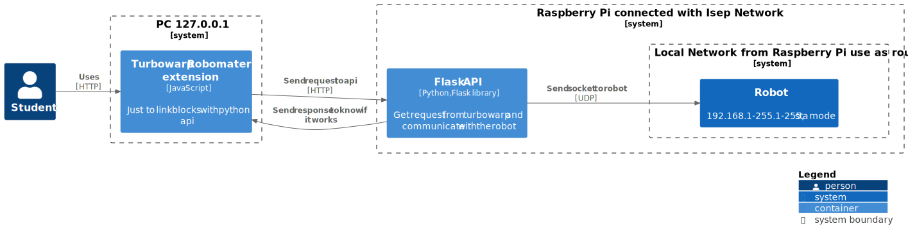

# Project Roadmap

## Development Environment

<!--
<div hidden>

```
@startuml actual
!include <C4/C4_Container>
LAYOUT_LEFT_RIGHT()

Person(admin, "Student")
System_Boundary(c1, "PC 127.0.0.1") {
    Container(turbowarp, "Turbowarp Robomater extension", "JavaScript", "Just to link blocks with python api")
    Container(api_app, "Flask API", "Python,  Flask library", "Get request from turbowarp and communicate with the robot")
}
System(robot, "Robot", "192.168.2.1, ap mode")

Rel(admin, turbowarp, "Uses", "HTTP")
Rel(turbowarp, api_app, "Send request to api", "HTTP")
Rel(api_app, robot, "Send socket to robot", "UDP")
Rel(api_app, turbowarp, "Send response to know if it works")

SHOW_LEGEND()
@enduml
```
</div>
-->


## Production Environment

### Option 1
<!--
<div hidden>

```
@startuml expected_1
!include <C4/C4_Container>
LAYOUT_LEFT_RIGHT()

Person(admin, "Student")
System_Boundary(c1, "PC 127.0.0.1") {
    Container(turbowarp, "Turbowarp Robomater extension", "JavaScript", "Just to link blocks with python api")
}
System_Boundary(c2, "ISEP Network") {
    Container(api_app, "Flask API", "Python,  Flask library", "Get request from turbowarp and communicate with the robot")
    System(robot, "Robot", "192.168.1-255.1-255, sta mode")
}


Rel(admin, turbowarp, "Uses", "HTTP")
Rel(turbowarp, api_app, "Send request to api", "HTTP")
Rel(api_app, robot, "Send socket to robot", "UDP")
Rel(api_app, turbowarp, "Send response to know if it works")

SHOW_LEGEND()
@enduml
```

</div>
-->


### Option 2

<!--
<div hidden>

```
@startuml expected_2
!include <C4/C4_Container>
LAYOUT_LEFT_RIGHT()

Person(admin, "Student")
System_Boundary(c1, "PC 127.0.0.1") {
    Container(turbowarp, "Turbowarp Robomater extension", "JavaScript", "Just to link blocks with python api")
}
System_Boundary(c2, "Raspberry Pi [10.42.0.1] connected with Isep Network") {
    Container(api_app, "Flask API", "Python,  Flask library", "Get request from turbowarp and communicate with the robot")
    System_Boundary(c3, "Local Network from Raspberry Pi use as router"){
        System(robot, "Robot", "10.42.0-255.1-255, sta mode")
}
   
}


Rel(admin, turbowarp, "Uses", "HTTP")
Rel(turbowarp, api_app, "Send request to api", "HTTP")
Rel(api_app, robot, "Send socket to robot", "UDP")
Rel(api_app, turbowarp, "Send response to know if it works")

SHOW_LEGEND()
@enduml
```

</div>
-->

